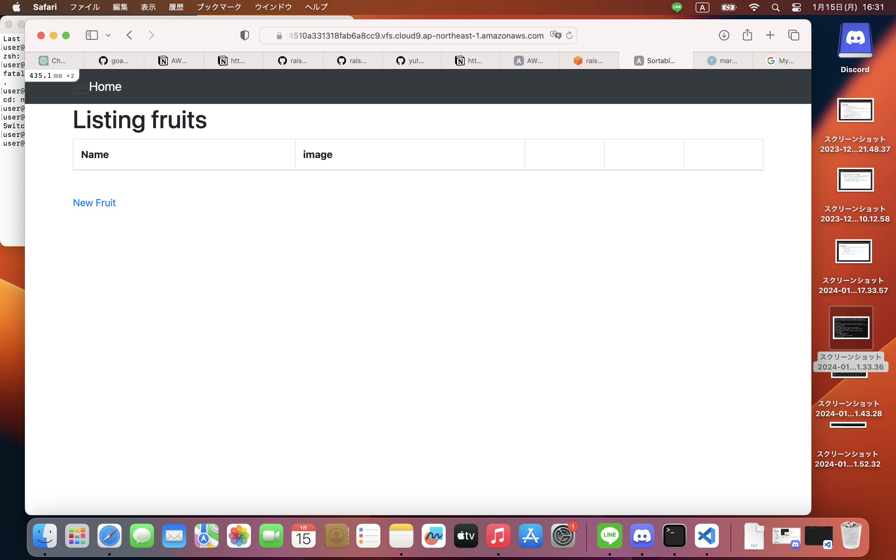
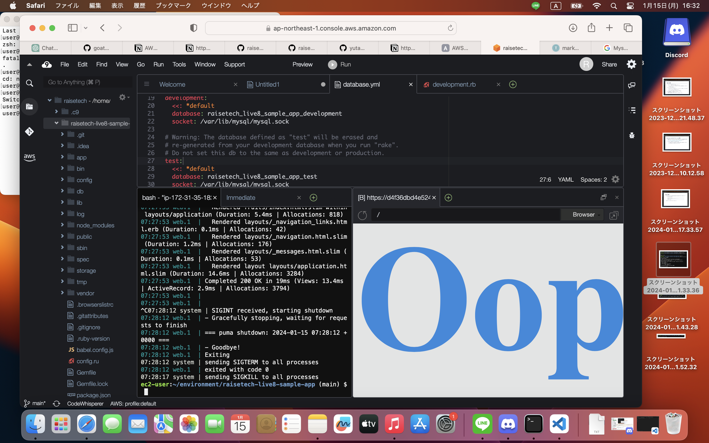
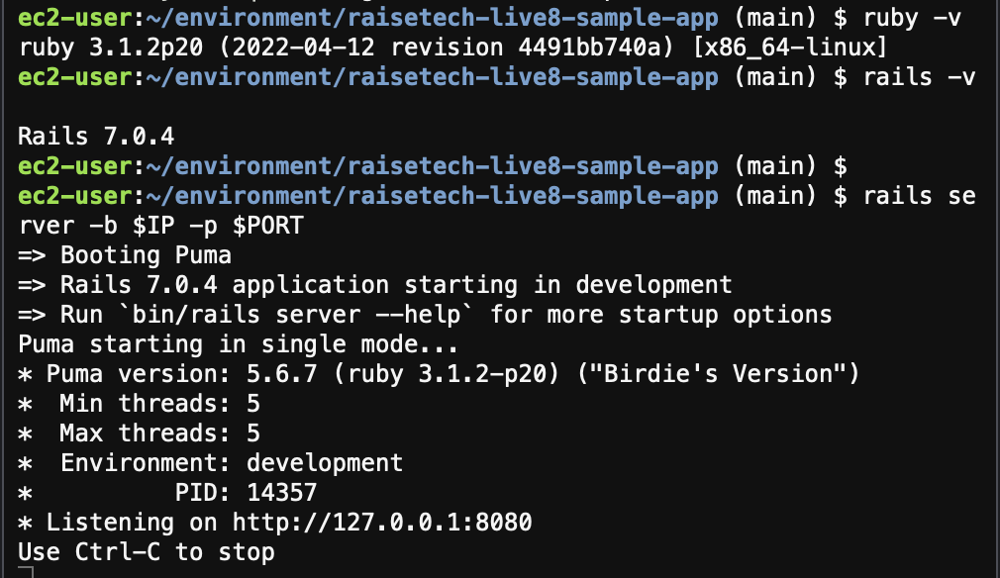
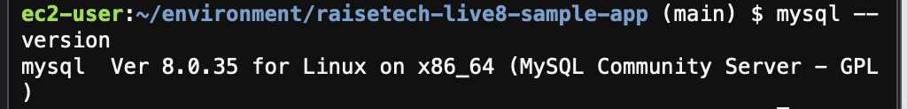
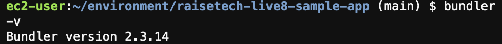

# 第3回課題

## 学んだこと
- Blocled hostsなどのエラーの解消方法、SAVEの重要性。
- Rails→MySQLに対してアクセスが発生するため、MySQL(my.cnf)側はアクセスが受けられるための設定、Rails(database.yml)は接続先はどこになるのかの設定を持つ必要性があること。

## 感じたこと
- 手動でアプリケーションを起動するためには、APサーバーとDBサーバーの双方が起動している必要があること。
- AWSの無料枠内でcloud9を扱うと、結構容量が足りないというようなエラーが出てくる。ある程度サクサクと進める必要性が出てきたら課金するのも手だということ。

### 課題参考画像

* 
* 
* 
* 
* 