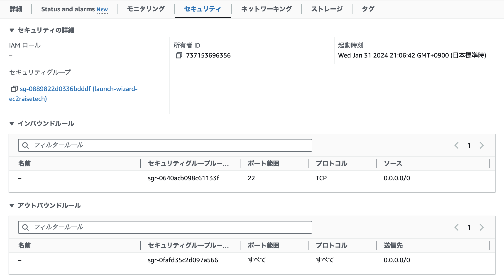

# 第4回課題

## 学んだこと
- VPC、EC2、RDSのそれぞれの役割
VPC=仮想ネットワーク、EC2=サーバー向けコンピューターを貸し出すサービス、RDS=クラウド内で簡単に設定、運用、スケールできるようにするマネージドサービスを集めたもの
- 構築する際の順番
AWS cloud→リージョン→VPC→①パブリックサブネット→EC２　②プライベートサブネット→RDS
- インバウンド・アウトバウンドの役割、ポート番号を設定する理由
コンピューター同士が互いに話す時のお約束事みたいなもの。「webサイトを見る」や「メールを送る」ための情報を、それぞれが適切な場所にちゃんと届くようにするために設定する。
- 公開鍵、秘密鍵、SSH接続
- IPアドレス=インターネット上の住所
- CIDR=IPアドレスを任意の単位で区切ることができる方法。IPアドレスを効率的に利用することができる。ネットワークやサブネットの範囲を分ける際にCIDR表記を使う。

### 参考資料

* 
* 
* 
* 
* 
* 
* 