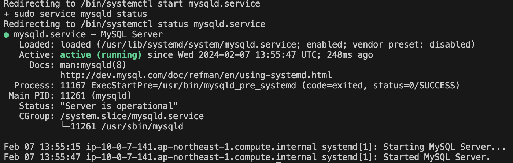

# 第5回課題

## 課題内容
1. EC2上にサンプルアプリケーションをデプロイ、動作させる
    1. 組み込みサーバーでのRailsアプリケーション動作確認
    2. Unicornを使ってのRailsアプリケーションの動作確認
    3. Nginxの単体起動確認
    4. NginxとUnicornを組み合わせてのRailsアプリケーション動作確認

2. ELB(ALB)を追加しての動作確認
3. S3を追加
4. インフラ構成図作成


## 1.EC2上にサンプルアプリケーションをデプロイ、動作
1. 組み込みサーバーでのRailsアプリケーションデプロイ

- パッケージをアップデート
```
$ sudo yum update
```

- 必要なパッケージをインストール（sudo yum -y install パッケージ名）を活用
```
$ sudo yum -y install gcc-c++ make patch git curl zlib-devel openssl-devel ImageMagick-devel readline-devel libcurl-devel libffi-devel libicu-devel libxml2-devel libxslt-devel
```

- Node.jsをインストール
```
#AWSのリポジトリに追加
$ curl -sL https://rpm.nodesource.com/setup_14.x | sudo bash -

#インストール
$ sudo yum -y install nodejs
```

- yarnをインストール
```
#AWSのリポジトリに追加
$ curl -sL https://dl.yarnpkg.com/rpm/yarn.repo | sudo tee /etc/yum.repos.d/yarn.repo

# インストール
$ sudo yum -y install yarn
```

- rbenvとruby-buildをインストール
```
# レポジトリをクローンしてインストール
$ git clone https://github.com/sstephenson/rbenv.git ~/.rbenv

# .bash_profileの設定
$ echo 'export PATH="$HOME/.rbenv/bin:$PATH"' >> ~/.bash_profile
$ echo 'eval "$(rbenv init -)"' >> ~/.bash_profile
$ source .bash_profile

# rubyをインストールするためにruby-buildをインストール
$ git clone https://github.com/sstephenson/ruby-build.git ~/.rbenv/plugins/ruby-build
```

- rubyをインストール
```
# rubyのインストール
$ rbenv install 3.1.2

# 実行中の表示
Installing ruby-3.1.2…

# 完了後に表示
Installed ruby-2.6.5 to /home/ec2-user/.rbenv/versions/3.1.2

待っても終わりの表記が出てこず。一度閉じて下記確認したところバージョン表記あり。

rbenvのバージョン確認
$ rbenv versions
結果：3.1.2. 　と表示される

# インストールしたrubyを使用可能にする
$ rbenv rehash

# このインスタンスで使用するバージョンの設定
$ rbenv global 3.1.2

下記コマンド実行して、インストールしたバージョンが表示されればOK
$ ruby -v
↓結果の表示
ruby 3.1.2p20 (2022-04-12 revision 4491bb740a) [x86_64-linux]
```

- Nodeをバージョン17.9.1に変更
```
# curl や wget を使って nvm インストールスクリプトをダウンロード
$ curl -o- https://raw.githubusercontent.com/nvm-sh/nvm/v0.39.1/install.sh | bash

# nvm スクリプトを読み込むために、ターミナルの新しいセッションを開始するか、現在のセッションで手動で読み込む
$ source ~/.bash_profile

# nvm を使って Node.js をインストール
$ nvm install 17.9.1

# 使用する Node.js バージョンを設定
$ nvm use 17.9.1
```

- Bunlerのバージョンを2.3.14でインストール
```
$ gem install bundler -v 2.3.14
```

- Railsのバージョンを7.0.4にする
```
# 新しいバージョンのRailsをインストールする
$ gem install rails -v 7.0.4

インストールしたファイル「Gemfile」を開く
# Bundle edge Rails instead: gem 'rails', github: 'rails/rails'
gem 'rails', '7.0.4'
と記載あり。
```

- アプリをgit clone
```
$ git clone https://github.com/yuta-ushijima/raisetech-live8-sample-app.git

# raisetech-live8-sample-appディレクトリに移動
$ cd raisetech-live8-sample-app
```

- Mysql設定
```
# システムに必要な依存関係が全てインストールされているか確認
$ sudo yum install mysql-devel

# 最新バージョンのBundlerとRubyGemsがインストール
されていることを確認
$ gem update --system
$ gem update bundler

# インストールを再試行（すべての依存関係が満たされていることを確認した後、mysql2 gemを再度インストールする）
$ gem install mysql2

# Mysqlのインストール
$ curl -fsSL https://raw.githubusercontent.com/MasatoshiMizumoto/raisetech_documents/main/aws/scripts/mysql_amazon_linux_2.sh | sh
```


