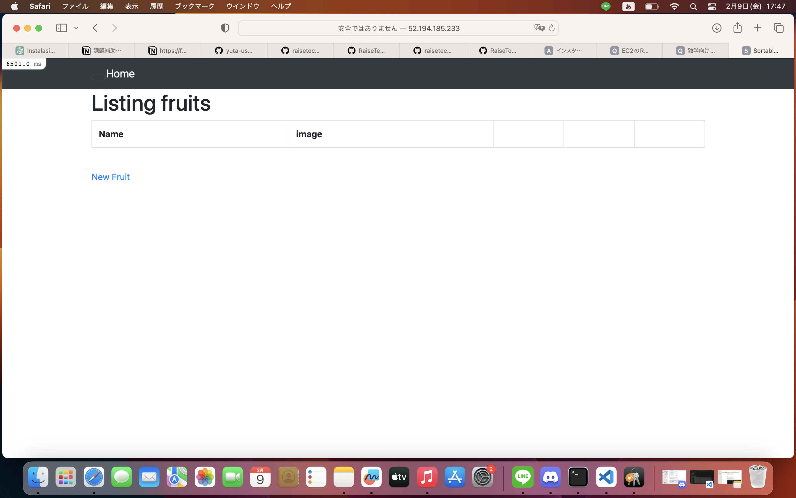
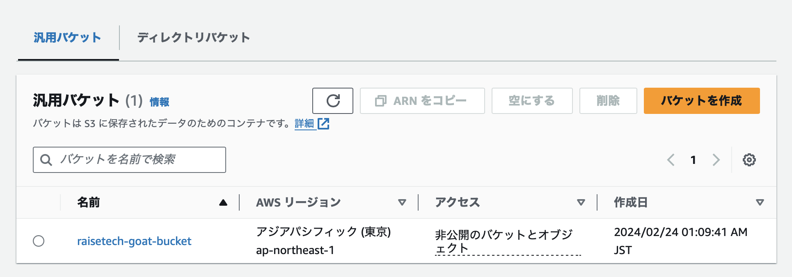

# 第5回課題

## 課題内容
1. EC2上にサンプルアプリケーションをデプロイ、動作させる
    1. 組み込みサーバーでのRailsアプリケーション動作確認
    2. Unicornを使ってのRailsアプリケーションの動作確認
    3. Nginxの単体起動確認
    4. NginxとUnicornを組み合わせてのRailsアプリケーション動作確認

2. ELB(ALB)を追加しての動作確認
3. S3を追加
4. インフラ構成図作成

## 1. EC2上にサンプルアプリケーションをデプロイ、動作させる

### 1-1.EC2上にサンプルアプリケーションをデプロイ、動作
1. 組み込みサーバーでのRailsアプリケーションデプロイ

- パッケージをアップデート
```
$ sudo yum update
```

- 必要なパッケージをインストール（sudo yum -y install パッケージ名）を活用
```
$ sudo yum -y install gcc-c++ make patch git curl zlib-devel openssl-devel ImageMagick-devel readline-devel libcurl-devel libffi-devel libicu-devel libxml2-devel libxslt-devel
```

- Node.jsをインストール
```
#AWSのリポジトリに追加
$ curl -sL https://rpm.nodesource.com/setup_14.x | sudo bash -

#インストール
$ sudo yum -y install nodejs
```

- yarnをインストール
```
#AWSのリポジトリに追加
$ curl -sL https://dl.yarnpkg.com/rpm/yarn.repo | sudo tee /etc/yum.repos.d/yarn.repo

# インストール
$ sudo yum -y install yarn
```

- rbenvとruby-buildをインストール
```
# レポジトリをクローンしてインストール
$ git clone https://github.com/sstephenson/rbenv.git ~/.rbenv

# .bash_profileの設定
$ echo 'export PATH="$HOME/.rbenv/bin:$PATH"' >> ~/.bash_profile
$ echo 'eval "$(rbenv init -)"' >> ~/.bash_profile
$ source .bash_profile

# rubyをインストールするためにruby-buildをインストール
$ git clone https://github.com/sstephenson/ruby-build.git ~/.rbenv/plugins/ruby-build
```

- rubyをインストール
```
# rubyのインストール
$ rbenv install 3.1.2

# 実行中の表示
Installing ruby-3.1.2…

# 完了後に表示
Installed ruby-2.6.5 to /home/ec2-user/.rbenv/versions/3.1.2

待っても終わりの表記が出てこず。一度閉じて下記確認したところバージョン表記あり。

rbenvのバージョン確認
$ rbenv versions
結果：3.1.2. 　と表示される

# インストールしたrubyを使用可能にする
$ rbenv rehash

# このインスタンスで使用するバージョンの設定
$ rbenv global 3.1.2

下記コマンド実行して、インストールしたバージョンが表示されればOK
$ ruby -v
↓結果の表示
ruby 3.1.2p20 (2022-04-12 revision 4491bb740a) [x86_64-linux]
```

- Nodeをバージョン17.9.1に変更
```
# curl や wget を使って nvm インストールスクリプトをダウンロード
$ curl -o- https://raw.githubusercontent.com/nvm-sh/nvm/v0.39.1/install.sh | bash

# nvm スクリプトを読み込むために、ターミナルの新しいセッションを開始するか、現在のセッションで手動で読み込む
$ source ~/.bash_profile

# nvm を使って Node.js をインストール
$ nvm install 17.9.1

# 使用する Node.js バージョンを設定
$ nvm use 17.9.1
```

- Bunlerのバージョンを2.3.14でインストール
```
$ gem install bundler -v 2.3.14
```

- Railsのバージョンを7.0.4にする
```
# 新しいバージョンのRailsをインストールする
$ gem install rails -v 7.0.4

インストールしたファイル「Gemfile」を開く
# Bundle edge Rails instead: gem 'rails', github: 'rails/rails'
gem 'rails', '7.0.4'
と記載あり。
```

- アプリをgit clone
```
$ git clone https://github.com/yuta-ushijima/raisetech-live8-sample-app.git

# raisetech-live8-sample-appディレクトリに移動
$ cd raisetech-live8-sample-app
```

- Mysql設定
```
# システムに必要な依存関係が全てインストールされているか確認
$ sudo yum install mysql-devel

# 最新バージョンのBundlerとRubyGemsがインストール
されていることを確認
$ gem update --system
$ gem update bundler

# インストールを再試行（すべての依存関係が満たされていることを確認した後、mysql2 gemを再度インストールする）
$ gem install mysql2

# Mysqlのインストール
$ curl -fsSL https://raw.githubusercontent.com/MasatoshiMizumoto/raisetech_documents/main/aws/scripts/mysql_amazon_linux_2.sh | sh
```


- database.ymlの中身を変更
```
# サンプルをコピー
$ cp config/database.yml.sample config/database.yml

# socketを確認
$ which mysql
$ which my conf
$ ls /etc/
$ cat /etc/my.cnf
表示されたsocketを控える
後ほどdatabase.ymlディレクトリ内の２２行目、３０行目に代入

# database.ymlを編集
$ vim config/database.yml

default: &default
    adapter: mysql2
    encoding: ut f8mb4
    pool: <%= ENV. fetch ("RAILS_MAX_THREADS") { 5 } %>
    username：設定したユーザ名
    password:設定したパスワード
    host: RDSのエンドポイント
    port: 3306
    timeout: 5000

# 再びセットアップ
$ bin/setup
$ bin/dev
```

- EC2のインバウンドルール
```
3000番ポート、80番ポートを開放
http://パブリックIPアドレス:3000/
でHPを確認
```




### 1-2.Unicornを使ってのRailsアプリケーションの動作確認

- インストール
```
$ gem install unicorn
```

- unicornの設定ファイルを作成
```
$ vim config/unicorn.rb

# 編集内容
listen '/home/ec2-user/raisetech-live8-sample-app/tmp/unicorn.sock'
listen 3000
pid    '/home/ec2-user/raisetech-live8-sample-app/tmp/unicorn.pid'
```

- Unicorn の起動・停止スクリプトを作成
```
# lib/tasks ディレクトリに unicorn.rake というファイルを生成
$ rails g task unicorn

$ vim lib/tasks/unicorn.rake

def unicorn_pid の File.read の引数のパスを下記に変更
/home/ec2-user/raisetech-live8-sample-app/tmp/unicorn.pid
```

- Unicornの動作
```
# Unicornの起動
$ rake unicorn:start
```

```
# Unicorn が起動しているかどうかを確認するコマンド
$ ps -ef | grep unicorn | grep -v grep

# Unicornの停止
$ rake unicorn:stop
```

- 起動エラー時
```
Unixシステムのルート / 以下のtmpファイル以下に「unicorn.sock」ファイルがないかを確認（Railsアプリケーション内のtmpファイルではない点に注意）
もし「/tmp/unicorn.sock」があった場合は、このファイルを先ほどの設定ファイル内で指定したパスに移動
$ sudo mv /tmp/unicorn.sock /home/{ユーザ名}/{Railsアプリケーション}/tmp
※　{} は入力しない

# もう一度起動コマンド実施
$ rake unicorn:start

http://パブリックIPアドレス:3000/　でHP確認
```

- unicornでアプリ起動確認


- unicornを停止した時の画面


### 1-3. Nginxの単体起動確認

- Nginxを起動
```
# Amazon Linux Extrasを確認する
$ yum search nginx

# nginxをインストール
$ sudo amazon-linux-extras install nginx1

# Nginxのバージョン確認
$ nginx -v
```

- Nginxを動かす
```
# nginxを起動
$ sudo systemctl start nginx
active(runnning)を確認

「http://パブリックIPアドレス/」でHP起動確認
下記画像参照

その他コマンド
# nginxが起動しているか等状態を確認
$ sudo systemctl status nginx

# nginxを停止
$ sudo systemctl stop nginx

# nginxの編集を行った際、編集内容を反映させて起動したい時
$ sudo systemctl restart nginx
```


### 1-4. NginxとUnicornを組み合わせてのRailsアプリケーション動作確認

- Nginxの設定ファイルの編集
```
# Nginxの設定ファイルの編集
$ sudo vim /etc/nginx/nginx.conf

# 設定内容

# For more information on configuration, see:
#   * Official English Documentation: http://nginx.org/en/docs/
#   * Official Russian Documentation: http://nginx.org/ru/docs/

user ec2-user;
worker_processes auto;
error_log /var/log/nginx/error.log;
pid /run/nginx.pid;

# Load dynamic modules. See /usr/share/doc/nginx/README.dynamic.
include /usr/share/nginx/modules/*.conf;

events {
    worker_connections 1024;
}

http {
    log_format  main  '$remote_addr - $remote_user [$time_local] "$request" '
                      '$status $body_bytes_sent "$http_referer" '
                      '"$http_user_agent" "$http_x_forwarded_for"';

    access_log  /var/log/nginx/access.log  main;

    sendfile            on;
    tcp_nopush          on;
    tcp_nodelay         on;
    keepalive_timeout   65;
    types_hash_max_size 4096;

    include             /etc/nginx/mime.types;
    default_type        application/octet-stream;

    # Load modular configuration files from the /etc/nginx/conf.d directory.
    # See http://nginx.org/en/docs/ngx_core_module.html#include
    # for more information.
    include /etc/nginx/conf.d/*.conf;

    upstream unicorn {
    server unix:/home/ec2-user/raisetech-live8-sample-app/tmp/unicorn.sock;
    }

    server {
        listen       80;
        listen       [::]:80;
        server_name  EC2のSSHクライアントDNS;
        root         /home/ec2-user/raisetech-live8-sample-app/public;
        #root         /usr/share/nginx/html;

        access_log /var/log/nginx/access.log;
        error_log /var/log/nginx/error.log;

        # Load configuration files for the default server block.
        include /etc/nginx/default.d/*.conf;

        try_files $uri/index.html $uri @unicorn;

        error_page 404 /404.html;
        location = /404.html {
        }

        error_page 500 502 503 504 /50x.html;
        location = /50x.html {
        }

        location @unicorn {
          proxy_set_header X-Real-IP $remote_addr;
          proxy_set_header X-Forwarded-For $proxy_add_x_forwarded_for;
          proxy_set_header Host $http_host;
          proxy_pass http://unicorn;
        }

     }
}

```

- エラーログ確認
```
$ sudo tail -f /var/log/nginx/error.log
$ sudo vi /var/log/nginx/error.log
```

- Nginxの権限変更
```
$ cd /var/lib
$ sudo chmod -R 775 nginx
```

unicornも起動し、HP起動確認


## 2. ELB(ALB)を追加しての動作確認

- ALB作成


- ターゲットグループ作成


 - blocked hostsエラー解消
 
 ```
DNS名で開こうとするとエラー発生

config/environments/development.rb　を編集しようと
$ cd raisetech-live8-sample-app/config
で移動しようとしてもconfigファイルがないとエラー(lsでconfigファイルがあることは確認済み)

# パーミッションの確認
$ ls -ld raisetech-live8-sample-app/config

# config/environmentsに移動
$ cd raisetech-live8-sample-app/config/environments

# lsにてdeveropment.rbファイルがあることを確認、編集
Rails.application.configure do
~~
config.hosts << "<許可したいホスト名>"
~~
end

# Unicornの停止
$ rake unicorn:stop

# 停止後もう一度起動
$ rake unicorn:start
 ```
 

## 3. S3を追加
Railsアプリケーションにウップロードした画像が、S3にも保存されるように設定

- S3にバケットを作成


- IAMにてロールを作成(許可ポリシー:「AmazonS3FullAccess)し、EC2にアタッチ


- IAMにてーユーザーを作成、アクセスキーとシークレットアクセスキーを発行

- config/storage.yml 編集
```
SSH接続し、$ cd raisetech-live8-sample-app　に移動

# config/storage.yml　編集
$ sudo vim config/storage.yml

amazon:
service: S3
access_key_id: <%= Rails.application.credentials.dig (:aws, :access_key_id) %> secret_access_key: <%= Rails.application.credentials.dig(: aws, secret _access _key) region: us-west-1
bucket: your -bucket -name
```

- config/environments/development.rb 編集
```
# Active Storageサービスを設定
$ sudo vim config/environments/development.rb

Rails.application.configure do
config.active_ storage.service = :amazon
end

config.active_ storage.service = :amazon
localからamazonに変更

unicorn、Nginx再起動
$ rake unicorn:stop
$ rake unicorn:start
$ sudo systemctl restart nginx
```


## 4. インフラ構成図作成

