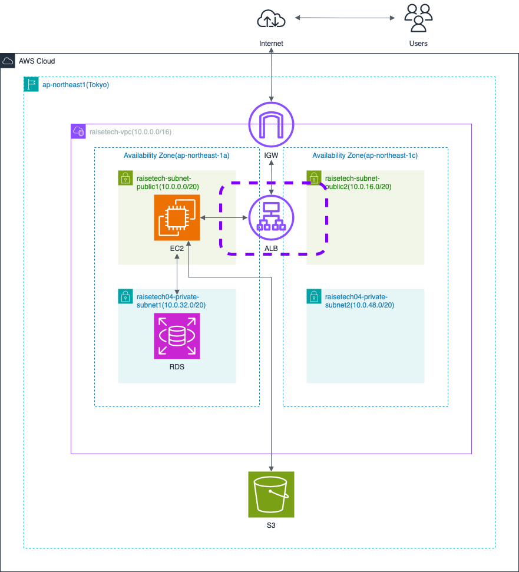

# 第10回課題

## 課題内容
1. CloudFormation を利用して、現在までに終った環境をコード化してみる
   - コード化ができたら実行してみて、環境が自動で作られることを確認

## 1. CloudFormation を利用して、現在までに終った環境をコード化してみる

- EnvironmentNameを「test10」　として、下記構成図のように作成



### スタック作成
スタックを各リソースごとに作成
1. VPC、サブネット、ルートテーブル、インターネットゲートウェイ
2. EC2、付随するセキュリティグループ
3. RDS、付随するセキュリティグループ
4. ALB、ターゲットグループ、付随するセキュリティグループ
5. S3、IAMのポリシー、ロール


###
1. VPC、サブネット、ルートテーブル、インターネットゲートウェイ

以下、CloudFormationで作成したリソースを記載
```
・VPC作成
        - VPC

・サブネット作成
    パブリックサブネット×２
        - PublicSubnet01
        - PublicSubnet02

    プライベートサブネット×２
        - PrivateSubnet01
        - PrivateSubnet02

・ルートテーブル作成
    パブリックサブネット用
        - PublicRouteTabl

    プライベートサブネット用
        - PrivateRouteTable

・作成したサブネットを、それぞれのルートテーブルへ割り振り
    パブリックサブネット×２　→ パブリックサブネット用のルートテーブルへ
        - PublicSubnet01RouteTableAssociation
        - PublicSubnet02RouteTableAssociation

    プライベートサブネット×２　→　プライベートサブネット用のルートテーブルへ
        - PrivateSubnet01RouteTableAssociation
        - PrivateSubnet02RouteTableAssociation

・InternetGateway作成
        - InternetGateway

    VPCにアタッチ
        - InternetGatewayAttachment

    パブリックルートテーブルとアタッチ
        - InternetGatewayToRouteTable
```
- VPC作成画面


- パブリックサブネットリソースマップ


- プライベートサブネットリソースマップ


2. EC2、付随するセキュリティグループ

以下、CloudFormationで作成したリソースを記載
```
・EC2インスタンス作成
        - EC2
    
・セキュリティグループ作成
        - EC2SecurityGroup
```
- EC2作成画面


- EC2セキュリティグループ


- SSH接続確認画面


3. RDS、付随するセキュリティグループ

以下、CloudFormationで作成したリソースを記載
```
・RDS作成
        - RDSInstance
    
・RDSサブネットグループを定義
        - RDSSubnetGroup

・RDSのセキュリティグループ作成
        - RDSSecurityGroup
```

- RDS作成画面


- RDSセキュリティグループ


- RDSサブネットグループ


4. ALB、ターゲットグループ、付随するセキュリティグループ

以下、CloudFormationで作成したリソースを記載
```
・ALB作成
        - ALB

・ALBのセキュリティグループ作成
        - ALBSecurityGroup
    
・ALBのリスナー作成
        - ListenerHTTP

・ターゲットグループ作成
        - ALBTargetGroup
```
- ALB作成画面


- ALBセキュリティグループ


- ターゲットグループ


5. S3、IAMのポリシー、ロール

以下、CloudFormationで作成したリソースを記載
```
・S3バケット作成
        - S3Bucket

・EC2へ、「AmazonS3FullAccess」ポリシーを許可するロールをアタッチする
    アクセスロール
        - S3AccessRole

    アクセスポリシー
        - S3AccessPolicies
    
    EC2インスタンスとロールを紐付けるために、IAMインスタンスプロファイルを記述
        - S3AccessInstanceProfile
    
●S3AccessInstanceProfile作成後、EC2用のスタックのEC2内「IamInstanceProfile」にインポート
```

- S3作成画面


- IAMロール確認


- AmazonFullAccessポリシーが許可されていることを確認
